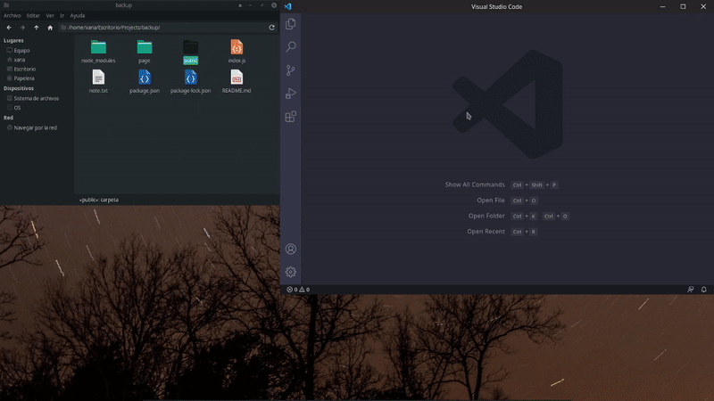
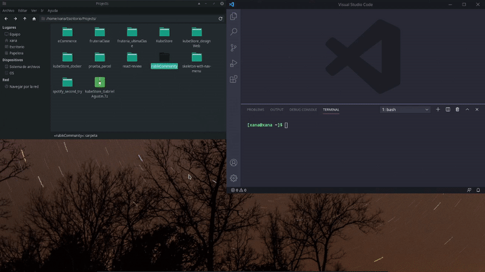

# Rubik's community 

## ¿Cómo iniciar la página?

Tienes dos opciones: 

1. Extensión [Live Server](https://github.com/ritwickdey/vscode-live-server). 
    1. Comprueba que lo tienes instalado. Si no es así busca `ritwickdey.liveserver` en el buscador de extensiones y descargala.
    2. Usando Live Server situate en la carpeta `public/` e inicia ahí el servidor de pruebas.

2. Node y npm. 
    1. Instalar las dependecias necesarias `npm install`
    2. Iniciar el servidor `node index.js`
    3. Servidor abierto en `http://localhost:2525`

## Archivos de la página

Los archivos originales se encuentran en el directorio `page/` 

Los archivos que hay en public son una vez se ha construido la web para ponerla en producción.

## Recursos utilizados

1. Responsive y animaciones
    - [Skeleton css](http://getskeleton.com/)
    - [Animate css](https://animate.style/)
2. Carousel con efecto de cubo.
    - [Swiper js](https://swiperjs.com/)
3. Iconos
    - [Font Awesome](https://fontawesome.com/)
    - [IconMonstr](https://iconmonstr.com/)
4. Lineas temporales
    - [Timeline Slider With jQuery - Roadmap](https://github.com/stefanomarra/jquery-roadmap)
    - [Timeline js](https://timeline.knightlab.com/)
5. Empaquetador web
    - [Parcel js](https://parceljs.org/)
6. Cosas simples
    - [JQuery](https://jquery.com/)

## Comentarios 

- Si se quiere detener el movimiento constante del carousel basta con hacer click en una de las flechas o agarrar y desplazar un poco este.

- También se ha incluido un ligero efecto de parallax en los textos del carousel

- Se necesita optimizar el efecto de cubo de swipe. En pantalla grande está se ve lenta y pesada. Puede que sea por el tamaño de las imagenes.

- La implementación de Timeline js funciona, pero a veces tiene un problema al cargar los recursos necesarios, así que si ves la página y no carga la sección de timeline que se encuentra en `history.html` no se preocupe que es un problema de CORS.

- Falta la implementación del cubo en 3D. Por eso hay un archivo suelto `our-cubes.html`.

